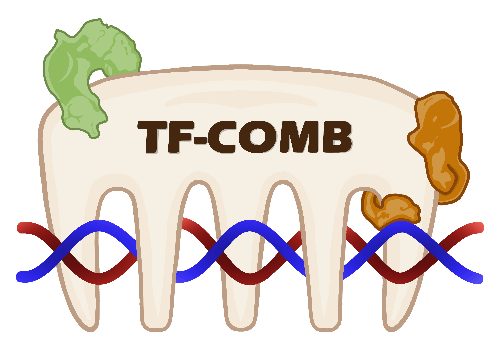

# TF-COMB

[](https://pypi.org/project/TF-COMB/)

TF-COMB stands for “**T**ranscription **F**actor **C**o-**O**ccurrence using **M**arket **B**asket analysis” and is a python module for identifying co-occurring TFs in regulatory regions.



With a flexible input of ChIP-seq peaks, motif positions, footprint locations, ATAC-seq peaks etc., TF-COMB utilizes a modified market basket analysis to identify TFs (or regions) which are highly co-occurring. The identified TF pairs can then be analyzed in more detail using downstream analysis such as:
- Preferred distance between TFs
- Orientation of stranded regions
- Differential co-occurrence between conditions
- Network analysis to identify protein hubs


Please visit the [Examples](https://tf-comb.readthedocs.io/en/latest/examples/index.html) to see modes of usage.

## Installation

TF-COMB can be quickly installed via pip:
```bash
$ pip install TF-COMB
```

Or directly from the github repository using the required_packages in a conda (mamba) environment:
```
$ mamba create -n tfcomb_env --file required_packages.txt
$ conda activate tfcomb_env 
$ pip install .
```  

## Usage
Please visit the full documentation at: [tf-comb.readthedocs.io](https://tf-comb.readthedocs.io)


## How to cite
Bentsen M, Heger V, Schultheis H, Kuenne C, Looso M. TF-COMB - Discovering grammar of transcription factor binding sites. Comput Struct Biotechnol J. 2022 Jul 21;20:4040-4051

DOI: https://doi.org/10.1016/j.csbj.2022.07.025
