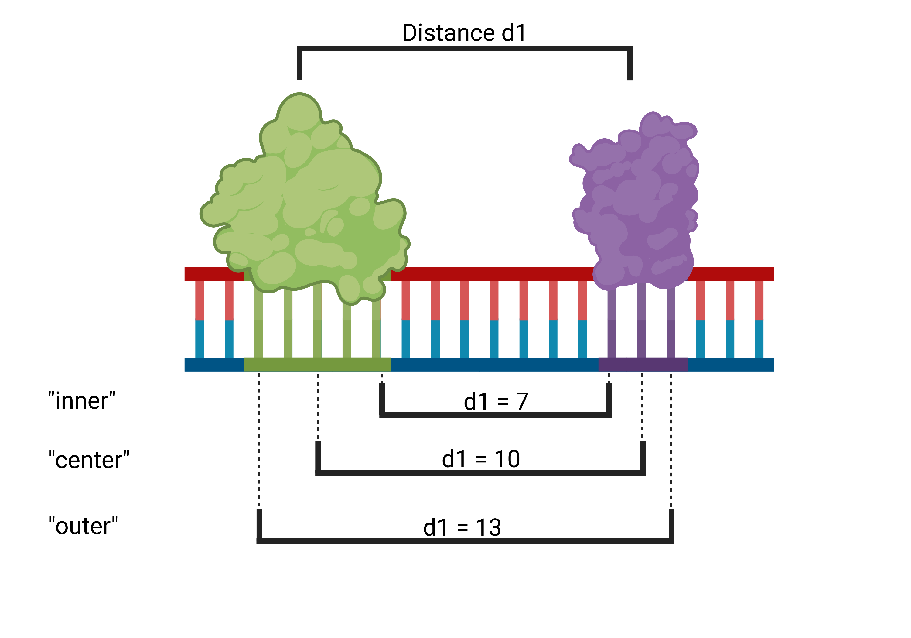

Anchor Modes
=============

To calculate whether a pair is within a specific window of size w and to interpret predicted preferred distances,
it is important to define an anchor point from which the distance is measured. 
TF-COMB supports three different anchor modes: inner, outer and center. 
The default mode is **inner**.

    1. **inner** (default) is the distance between the transcription factors, it is measures as :math:`start(TF B) - end(TF A)` . If for example transcription factor B is directly adjacent to Transcription factor A, the difference will be zero.
    2. **center** is the distance measured from mid of transcription factor to mid of transcription factor :math:`center(TF B) - center (TF A)`
    3. **outer** (uncommonly used) is the distance measured including both transcription factors. :math:`end(TF B) - start(TF A)`

    Created with `BioRender.com <https://biorender.com/>`_.