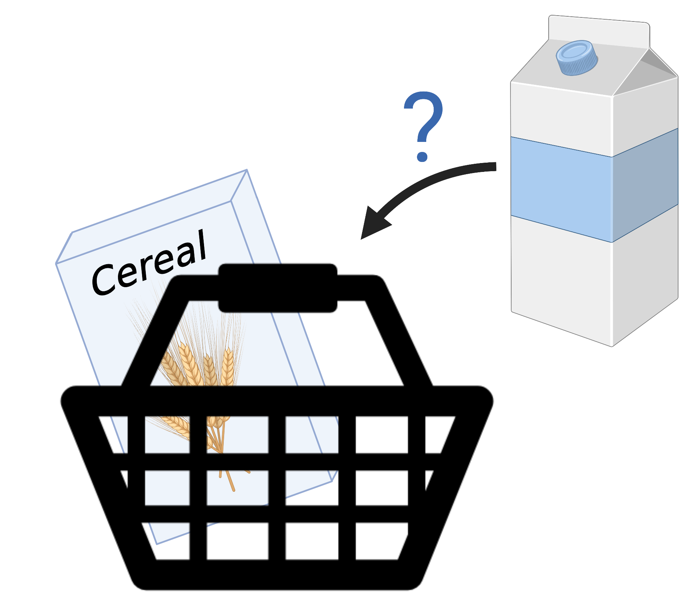
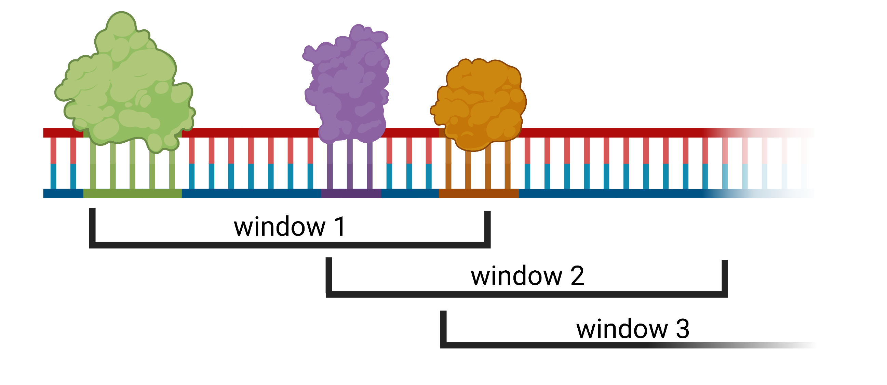

============================================
Adopted Market Basket Analysis (adopted MBA)
============================================

To explore relationships between items bought by customers a frequent pattern mining approach called market basket analysis (MBA) can be applied.
The basic idea behind TF-COMB is utilizing such a MBA in a way applicable to transcription factor (TF) binding data to uncover 
co-occurrences between TFs. Here we present the classical MBA approach and how we altered it to cope with the special biological challenges.

Market Basket Analysis (MBA)
============================
| The MBA is part of the broader field of data mining and aims to reveal patterns of items frequently bought (observed) together.
| For example to answer the question: "If customers are buying cereal (A), is it likely they will also buy milk (B)?".

    Created with `BioRender.com <https://biorender.com/>`_.

| **What kind of data is needed to calculate relationships?**
| For a classical MBA the transactions / baskets for each customer are examined and encoded binarized in a large matrix.

| Based on the matrix a variety of **metrics** can be calculated like the widely used *support* and *confidence*:

support
*********
.. math::
    (A \rightarrow B) = P(A,B) = \frac{frequency(A,B)}{N} 

confidence
************
.. math::
    (A \rightarrow B) = P(B | A) = \frac{frequency(A,B)}{frequency(A)}

| Frequent itemsets, also called *rules*, are composed by algorithms like *apriori* or *Frequent Pattern (FP) Growth* taking these
 measures into account. 

But TF binding data is no (super-)market?
=========================================
As mentioned above we took this approach and asked if we can transfer the concept to be applied to biological data in a way that 
we can answer the question: "If we observe *TFA*, is it likely we will also observe *TFB*?"
Assuming TF factors to be items posed some challenges due to the nature of the data, explained below.

What are transactions/windows in TF binding data? 
=================================================
The first question translating the MBA concept to TF binding data was how to define transactions/baskets. Since we assumed TF factors to be 
the items we want to examine, we need a counterpart for transactions. Therefore, we constructed arbitrary windows of a given size w. 
However, the human genome for example is huge and utilizing a *sliding window approach* to slice the genome is computational expensive as well
as resulting in many windows without valuable information content. Therefore, we assumed every genomic TF start position to denote the start
of a window, resulting in a number of windows (transactions) equals observed TFs.

Created with `BioRender.com <https://biorender.com/>`_.

How we resolved overlapping
============================
TFs and their respective binding sites do not only occur side-by-side but sometimes also overlap each other. To enable full control of these 
special cases, TF-COMB offers a parameter to control the amount of allowed overlap ranging from 0 (no overlap allowed) to 1 (full overlap allowed).
Overlap is calculated in percentage of the shorter binding site overlapping the larger binding site.

Metrics
========
To assess the importance of the found rules a variety of metrics exist [#ref1]_ . Besides the above mentioned support, which is calculated automatically,
TF-COMB supports *cosine*, *confidence*, *lift* or *jaccard*.    

lift
*********
.. math::
    \frac{confidence}{support(B)}

cosine
*********
.. math::
    \frac{support(A,B)}{\sqrt{support(A)*support(B)}}

confidence
************
.. math::
    \frac{support(A,B)}{support(A)}

jaccard
*********
.. math::
    \frac{support(A,B)}{support(A) + support(B) - support(A,B)}

.. [#ref1] Pang-Ning Tan, Vipin Kumar, Jaideep Srivastava, *Selecting the right objective measure for association analysis*, `Information Systems Volume 29, Issue 4, 293-313 (2004) <https://doi.org/10.1016/S0306-4379(03)00072-3>`__